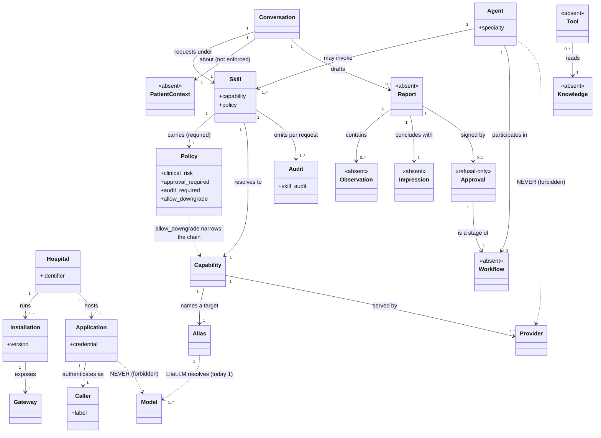
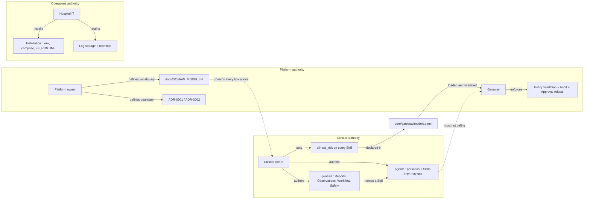

# FutureKind Domain Model

**Status:** Proposed — this document asks to be accepted, then to become the authority
**Date:** 2026-10-07
**Scope:** Language only. No implementation, no provider work, no routing change, no new feature.
**Governing decisions:** [ADR-0001 Local-First AI](adr/ADR-0001-Local-First-AI.md), [ADR-0002 Gateway vs LiteLLM](adr/ADR-0002-Gateway-vs-LiteLLM.md)
**Written with:** [gateway-routing.md](architecture/gateway-routing.md), [gateway-policy.md](architecture/gateway-policy.md)

---

## 1. Why this document exists

A ubiquitous language is not a glossary. It is the set of words a team agrees
carry exactly one meaning each, so that a sentence in a document, a key in a
config file, a class in code and a line in a log all name the same thing.

FutureKind has, today, two vocabularies that have never been reconciled:

- **A platform vocabulary** — *Application, Gateway, LiteLLM, Model Router, LLM*
  (`docs/ARCHITECTURE.md:32-98`, `:138-154`) — which describes infrastructure.
- **A governance vocabulary** — *Skill, Capability, Policy, Alias, Provider,
  Model, Approval, Audit* — which exists only in `core/gateway/` and the two
  architecture notes derived from it.

The two do not overlap by a clinical term. `docs/ARCHITECTURE.md` has no occurrence of
Provider, Skill, Capability, Alias, Workflow, Knowledge, Tool, Agent, Backend or Tenant —
and one each of Policy, Approval and Report. It says *Model Router*
(`:150`) and *LLM* (`:154`) where the Gateway says *Provider* and *Model*. The
platform's own top-level document does not speak the language its most
governance-heavy component enforces.

And the third vocabulary — the clinical one — does not exist yet. `genesis/` and
`agents/` were its intended home; they held twelve zero-byte files and sixteen
files of one-to-ten-byte keystroke noise (`agents/radiology/agent.yaml` contained
the four characters `yaml`), and were deleted on 2026-10-08 rather than kept as an
advertisement. The clinical layer is scheduled work, not a directory. `core/audit`, `core/auth`, `core/cli`, `core/config`,
`core/notifications`, `core/sdk` and every directory under `services/` hold no
files. This sentence used to be a file count, and counts drift, so it states the
rule that keeps it true instead: the Gateway's source and tests are committed and CI
runs both, the hand-written `openapi.yaml` is deleted in favour of the served
contract, and any number of tracked files is verified with `git ls-files | wc -l`
rather than trusted from a paragraph.
So the words *Report*, *Observation*, *Patient Context*, *Knowledge*, *Tool* and
*Agent* have no referent in this repository — and the ones that do are defined
by the Gateway alone, which is not where a clinical language should be born.

**Consequence for this document.** Every concept below carries a status, and the
status is the finding:

| Status | Meaning |
| --- | --- |
| **[CODE]** | Named in code, enforced, testable today. |
| **[DOC]** | Used in prose or config, with no definition and no enforcement. |
| **[ABSENT]** | No occurrence in the repository. The definition below is *proposed*, not reported. |

Marking an invented term as if the repository already used it would be the worst
possible outcome for a domain model, because the next reader would search for
evidence, find none, and distrust the whole document.

**Citation convention.** `path:line` pairs point at content that exists as this
file was written. Shorthand resolves as follows: a bare `*.py` name is under
`core/gateway/src/futurekind_gateway/` (`catalog.py`, `routing.py`, `policy.py`,
`service.py`, `schemas.py`, `deps.py`, `metrics.py`, `logging.py`); `models.yaml`,
`pyproject.toml` and `test_*.py` are under `core/gateway/`; `gateway-routing.md`
and `gateway-policy.md` are under `docs/architecture/`; `ARCHITECTURE.md` under
`docs/`; `CONTRIBUTING.md`, `.env.example` and `compose.yaml` are at the repository
root (`VERSION` was deleted in the 2026-10-08 pass, which is why the root is not a
version source); `ADR-0001` and `ADR-0002` both sit at `docs/adr/` — they did
not until the 2026-10-08 hygiene pass flattened a doubled `adr/adr/` segment, which
is R9. Every one of these was re-read from the file before
being cited; a citation that has since drifted is a defect in this document, not
a puzzle to be guessed at.

---

## 2. The four contexts

The platform is not one domain; it is a clinical domain served by a governance
domain running on a runtime domain, installed by an operational domain. Each has
its own nouns, and the nouns must not cross without being named.

| Context | The question it answers | Canonical nouns | Status today |
| --- | --- | --- | --- |
| **Clinical Documentation** | What is the medicine, and what may be written about a patient? | Patient Context, Observation, Impression, Report, Sign-off, Workflow | [ABSENT] — the `genesis/` and `agents/` placeholders that stood for it were deleted 2026-10-08. **Designed 2026-10-09** in this section and in `docs/product/PRODUCT_BIBLE.md`; still no code, so the status has not moved |
| **Platform Governance** | Was this request allowed, and what is the record? | Application, Skill, Policy, Audit, Approval, Caller | [CODE] in `core/gateway/` only |
| **Runtime Execution** | What actually computed the answer? | Gateway, LiteLLM, Capability, Alias, Provider, Model | Split: [CODE] in the Gateway, [DOC] elsewhere |
| **Deployment & Operations** | Whose hardware, whose data, whose rules? | Hospital, Installation, Runtime data, Health, Observability | [DOC] — prose and empty directories |

The most important sentence in the model is a boundary sentence: **a term belongs
to exactly one context, and a context may not redefine another's term.**
`ARCHITECTURE.md:104-110` already enforces that idea mechanically for traffic
("Applications never communicate directly with AI models"); this document asks
for the same discipline about words.

---

## 3. Concepts

### Runtime Execution

#### Model — [CODE]

**Definition.** The weights that generate tokens. A deployment detail, identified
by a backend-specific string such as `qwen3:14b`.
**Purpose.** Answering. It is the only concept here that does not *decide* anything.
**Owner.** FutureKind Services, via LiteLLM (ADR-0002 `:97`).
**Public / internal.** Internal to choose, public to report: ADR-0002 rule 1
(`:103`) forbids a request naming one and requires a response to disclose which
answered, because "the right to know what answered is not the right to choose
what answers".
**Lifecycle.** Named in `core/gateway/models.yaml:104` → carried on `ModelEntry`
(`catalog.py:207`) → rewritten per candidate on each attempt → reported in the
response and in `skill_audit` if it answered.
**Relationships.** One **Alias** resolves to one Model *today*; after ADR-0002
step 3 an Alias may resolve to several, on several Providers. The Gateway knows
a Model only as a string it is told.
**Examples.** `ollama/gpt-oss:20b` (`configs/litellm/config.yaml:5`),
`fk-reasoning` → `qwen3:14b`.
**Banned synonyms.** "LLM" as a chain hop (`ARCHITECTURE.md:154`), "engine",
"weights" in prose are tolerable; "model selector" is not — that affordance was
deleted in Sprint 1.

#### Alias — [CODE, unresolved]

**Definition.** The stable FutureKind name for a routing target, agreed between
the Gateway's catalogue and LiteLLM's model list: `fk-default`, `fk-fast`,
`fk-reasoning`.
**Purpose.** To let the platform say *which kind of horsepower this skill needs*
without naming weights. It is the seam ADR-0002 step 3 (`:141`) widens into a
replacement of `provider:`+`model:`.
**Owner.** Declared by the operator in `models.yaml`; resolved by LiteLLM. Shared
by name, which is exactly why ADR-0002 `:122` insists on a startup existence check.
**Public / internal.** Internal in both directions: it appears in no request and
no response. It is a log field only (`skill_audit.alias`).
**Lifecycle.** Written in `models.yaml:108` → validated for uniqueness at load
(`catalog.py`, `ModelCatalog.__post_init__`) → carried on `Route.alias` → logged.
Never resolved by the Gateway, so a typo currently fails upstream, not at startup.
**Relationships.** Exactly one per `ModelEntry`; a **Capability** row owns it; a
**Provider** is what it eventually addresses.
**Examples.** `alias: fk-reasoning` (`models.yaml:124`) ↔
`model_name: fk-reasoning` (`configs/litellm/config.yaml:13`).
**Note.** What LiteLLM calls `model_name`, FutureKind calls an **Alias**. The
external key cannot be renamed; the language must translate it explicitly, or
the two names will keep reading as two concepts.

#### Provider — [CODE]

**Definition.** The execution backend the Gateway hands a request to next: an
object satisfying the `Provider` contract, addressed by a name in the catalogue.
**Purpose.** To make "where the request goes" one replaceable seam rather than
scattered HTTP calls.
**Owner.** FutureKind Services. Under ADR-0002 there is exactly one on the path:
LiteLLM.
**Public / internal.** Internal. Accepted in no request; reported in responses
for provenance.
**Lifecycle.** Named per row (`models.yaml:106-127`) → looked up lazily in
`ProviderRegistry` → answered by a class (`LiteLLMProvider`, registered only by
`main.build_production_app`) or refused `501 provider_not_implemented`
(`service.py:_resolve_provider`) → closed on shutdown.
**Relationships.** A `ModelEntry` names one Provider; a **Route** walks a chain of
entries, each with its own Provider; **Policy** decides how many entries it may
walk.
**Examples.** `provider: litellm` in the shipped catalogue — the transport, not the
backend family. Since Sprint 6 the family lives inside `model:` as
`ollama/gpt-oss:20b`, which is what the alias resolves to *behind* LiteLLM; the
Gateway sends the alias and reports the family for provenance.
**Banned synonyms.** "backend", "service", "engine", "AI Servers"
(`ARCHITECTURE.md:98`). And the homonym that must be fixed: ADR-0001 `:19` uses
**"Cloud AI providers"** to mean *vendors*. A vendor is not a Provider. See R2.

#### Capability — [CODE]

**Definition.** The technical class of processing a request needs: `default`,
`fast`, `reasoning`, and in time `vision`, `embedding`.
**Purpose.** The layer between intent and infrastructure, so that many **Skills**
can share one processing class and neither side has to know the other.
**Owner.** FutureKind Core (Gateway), per ADR-0002 `:105`.
**Public / internal.** Public *today* as a legacy selector, and that is debt:
ADR-0002 `:154` schedules it to become an internal refinement. It is internal in
the sense that matters — no clinician chose it.
**Lifecycle.** Key of each `models:` row → resolved from a Skill's declaration
(`routing.py:129-145`) → narrowed by Policy into a chain → reported as
`capability` and as a metrics label (`metrics.py:43`).
**Relationships.** One per **Skill**'s `capability:` line; many Skills to one
Capability (`radiology-report` and `pathology-review` both → `reasoning`); owns an
**Alias** and a **Model**.
**Examples.** `reasoning` (`models.yaml:56`).
**Known defect, named not hidden.** `default`/`fast`/`reasoning` conflate service
class with task type, as the 2026-10-07 layering review recorded it (an internal working paper, not published here; the defect stands on its own evidence below).
Until a modality axis exists, `vision` and `embedding` cannot be expressed,
because one row names one model.

#### Gateway — [CODE]

**Definition.** `core/gateway/` — the service that authenticates a caller,
resolves a **Skill**, enforces **Policy**, and records an **Audit**. The single
entry point for AI traffic (`ARCHITECTURE.md:106`).
**Purpose.** To be the place where *what was asked for* and *who was allowed to
ask* are decided, so that no other layer has to.
**Owner.** FutureKind Core.
**Public / internal.** Public: it is the only surface an application may call.
**Lifecycle.** Loads settings, catalogue and policy at start, proves its aliases
exist on LiteLLM's side, then serves `/chat`, `/v1/chat/completions`, `/v1/models`,
`/models`, `/health`, `/health/ready`, `/metrics` → refuses on invalid policy →
closes providers on shutdown. Startup is non-fatal for a broken catalogue, and fatal
for an alias LiteLLM does not know (SPEC-07-03).
**Relationships.** One per Hospital installation. Sits between **Application** and
**LiteLLM**; owns Skill, Policy, Audit, Approval enforcement, clinical context.
**Examples.** `POST /chat {skill: "radiology-report"}`.
**Banned synonyms — this is the worst collision in the repository.**
`configs/futurekind.yaml` read `gateway: LiteLLM`. One word, two owners, in
the platform's own config: the Gateway is *FutureKind's service*, and LiteLLM is
also called *the gateway*. ADR-0002 exists to separate them, and Sprint 6 executed
the separation in configuration too — `:40` is now `gateway: FutureKind Gateway`
and `:42` is `routing: LiteLLM`. See R1.

#### LiteLLM — [DOC]

**Definition.** The routing layer the Gateway hands an **Alias** to; it owns
model aliases, provider routing, model routing, retries, failover and cost
(ADR-0002 `:97`).
**Purpose.** To be the only place "which model, on which backend, with what
retry" is answered.
**Owner.** FutureKind Services.
**Public / internal.** Internal. Applications must never reach it
(`ARCHITECTURE.md:104`), and it must never learn a **Skill** name
(`gateway-routing.md`, "Forbidden").
**Lifecycle.** A container (`compose.yaml:54` `fk-litellm`) started from
`configs/litellm/config.yaml`. Not yet integrated: the path cited by
`gateway-routing.md:26` — `services/ai/litellm/` — names no directory in this
repository, because there is no `services/` tree at all.
**Relationships.** Resolves **Alias** → **Model** + **Provider**; is the only
**Provider** the Gateway should implement against.
**Banned synonyms.** "Model Router" (`ARCHITECTURE.md:150`) — that is a hop
*inside* LiteLLM, not a peer box, and naming it in the chain makes the Gateway's
`ModelRouter` class (`routing.py:86`) look like its counterpart. It is not: the
Gateway routes **Skills**, LiteLLM routes **models**. See R3.

### Platform Governance

#### Application — [DOC], [CODE as "caller"]

**Definition.** A piece of software a human uses to do clinical work: CARE ERP,
Radiology, Pathology, Patient Portal, WhatsApp, Voice (`ARCHITECTURE.md:36-46`).
**Purpose.** To state intent. It is the only context that may say *what I am
doing*, and it may say nothing else about infrastructure.
**Owner.** The product teams that build it — including, today, the same person
who owns the platform.
**Public / internal.** Public: it is the caller.
**Lifecycle.** Declared nowhere in configuration. Authenticates with an API key;
the Gateway derives a non-secret digest label (`deps.py:67 caller_label`) and
nothing else. So the platform cannot answer "which application sent this?"
beyond "one of N keys".
**Relationships.** Sends **Conversation** to the Gateway naming one **Skill**; is
the boundary `ARCHITECTURE.md:12-14` draws — "FutureKind is not an application."
**Examples.** `{"skill": "radiology-report", "messages": [...]}`.
**Banned synonyms.** "client", "consumer", "frontend", "module"
(`CONTRIBUTING.md:33`). And note the code/prose split: docs say **Application**,
code says **caller** (`AuthenticatedCaller`). Both are defensible — *Application*
is the domain noun, *caller* is the role in one request — but the document must
say so or the mismatch reads as two concepts. See R6.

#### Skill — [CODE]

**Definition.** An application's stated clinical intent, named by the
application, governed by the operator: `radiology-report`, `pathology-review`,
`clinical-chat`, `summarize-document`.
**Purpose.** To be the only selector a caller may use, and the only place
clinical intent survives. It is what makes "changing hardware never requires
application changes" true rather than aspirational.
**Owner.** Name and intent: the application team. Capability and policy behind
it: the operator (`models.yaml:39-102`).
**Public / internal.** Public — the only public intent word in the platform.
**Lifecycle.** Declared in `models.yaml` → loaded and validated at startup
(`catalog.py:114`, `Skill.from_raw`) → refused at load if `clinical_risk` is
missing or an unsafe combination → resolved per request (`routing.py:129`) →
reported on the response and every log line → disabled skills still list, marked.
**Relationships.** Exactly one **Capability**; exactly one **Policy** (required,
validated, inherited from a fail-closed floor); many Skills may share one
Capability; a Skill is *not* a **Report** — it is the request for one.
**Examples.** `radiology-report: {capability: reasoning, clinical_risk: high,
allow_downgrade: false}` (`models.yaml:54-66`).
**Banned synonyms.** "use case", "mode", "task", and — importantly — **Agent**.
See R4.

#### Policy — [CODE]

**Definition.** The set of governance decisions attached to one **Skill**:
clinical risk level, approval requirement, audit requirement, whether a lesser
class may answer, and the request limits that skill runs under.
**Purpose.** So that a clinical rule is an operator's edit with a diff, not a
code review with a release. ADR-0002 `:105` makes this the Gateway's, in
`models.yaml`, nowhere else.
**Owner.** The operator, who is the clinical owner — not a developer, and never
a caller.
**Public / internal.** Written internally, reported outward (governance fields
only, never numeric limits), never accepted from a request. A caller sending
`allow_downgrade` gets `422`: a rule a caller can relax is not a rule.
**Lifecycle.** Flat keys in a skill stanza (`POLICY_KEYS`, `policy.py`) →
validated at load, including the couplings (high/critical force audit and
refuse downgrade; critical forces approval) → folded onto the Route → enforced
before a provider is named → reported in the completion and the audit line.
**Relationships.** One per **Skill**; constrains **Capability** chain length,
**Model** timeout, **Audit** emission and **Approval** refusal.
**Examples.** `clinical_risk: high` + `allow_downgrade: false`
(`models.yaml:62-64`).
**Banned synonyms.** "tier" (a word ADR-0002 `:155` explicitly declines to
invent), "mode", "profile", "class", "severity" — **severity** belongs to the
incident report, not the request. And **risk level must never be spelled
`risk`** — the key is `clinical_risk` because plain `risk` will eventually mean
something else.

#### Audit — [CODE in part], [DOC in part]

**Definition.** Two distinct things today, and the language must separate them:
(1) the **Gateway's own structured log stream** — one `skill_audit` line per
audited request, whatever the outcome (`service.py:316`), with no prompt or
completion text; (2) the **Core Audit service** — an *empty* `core/audit/`, a box
in `ARCHITECTURE.md:56` with no implementation.
**Purpose.** To be able to answer, months later, who asked, under what policy,
against which alias, answered by which model, and whether it was allowed to
downgrade.
**Owner.** Emission: FutureKind Core (Gateway). Storage, retention, retrieval:
the unbuilt Audit service.
**Public / internal.** Internal. Never returned to a caller; available to an
operator and an investigator.
**Lifecycle.** Emitted per request at completion or refusal → written as JSON to
stdout → shipped by whatever collects logs (nothing configured, and nothing was ever
checked in: `monitoring/` and `services/` held only empty directories, removed 2026-10-08).
**Relationships.** Governed by **Policy**'s `audit_required`; names **Skill**,
**Capability**, **Alias**, **Model**, **Caller**, request id.
**Examples.** `{"event":"skill_audit","skill":"radiology-report",
"clinical_risk":"high","alias":"fk-reasoning","answered":false}`.
**Banned synonyms.** "log" as a peer of Audit — logs are the medium, the audit is
the record; `ARCHITECTURE.md:118-122` lists Audit and Logging separately, which
is correct and should be kept.
**Status decision needed.** Until `core/audit` exists, "Audit" must be used only
for the Gateway's emissions, or the platform will read as if a medicolegal record
exists. `configs/litellm/config.yaml:22` sets `disable_spend_logs: true`, so even
LiteLLM's own record is off — see Q3.

#### Approval — [CODE as refusal], [ABSENT as workflow]

**Definition.** A clinician's recorded acceptance of an AI-generated clinical
statement, made by a named human, before that statement is acted on.
**Purpose.** To keep *Human in Control* (`ARCHITECTURE.md:21`) from being only a
slogan, and to make the moment of responsibility an event rather than a hope.
**Owner.** The clinical domain. Not the Gateway, which can only *require* it.
**Public / internal.** Declared in **Policy** (internal to the catalogue),
surfaced to the application on every completion (`approval_required`), never
grantable by the caller.
**Lifecycle.** Today: declared → validated (critical forces it) → enforced as
`403 approval_required` → audited. That is the whole lifecycle, and `gateway-policy.md:213`
states it plainly: "Approval is a refusal, not a workflow."
**Relationships.** A **Workflow** stage; attached to a **Skill**; consumes a
**Report**'s draft and produces an **Approval** record — *sign-off* being the act,
*Approval* being the thing the record is; belongs to a **Patient Context**.
**Examples.** No shipped skill declares it (`models.yaml` sets none), so the gate
is live and tested but never reachable in production today.
**Banned synonyms.** "verification" — the docs currently use *verify* for both
clinical sign-off (`gateway-routing.md:162` "no approvals service that could
verify the sign-off") and engineering validation of a config file
(`gateway-policy.md`, validation section) — two different acts sharing one word.
"review" (a **Skill** is reviewed; a Report is *signed*), and "signing" are
banned as system nouns. Keep **sign-off** as the clinical *verb* and **Approval**
as the system *noun*: two names for one act is how a workflow gets built twice.
**Do not** let a future implementation accept a self-attested boolean from the
caller. That is not a workflow; it is a falsifiable signature.

#### Caller — [CODE]

**Definition.** The authenticated identity of whoever presented a credential to
the Gateway in one request, reduced to a non-secret digest label.
**Purpose.** Attribution without exposure: enough to say "this key did that" in
an audit line, not enough to leak the key into the log it explains.
**Owner.** FutureKind Core (authorization).
**Public / internal.** Internal. Never echoed to anyone.
**Lifecycle.** Header → constant-time comparison against configured keys →
label bound to `request.state.caller` (`deps.py:67`, `:122`) → written into the
access log line → discarded at request end.
**Relationships.** A proxy for an **Application**, and only that: one key may be
shared by several applications, and no key is bound to a **Hospital** or a human.
**Examples.** `X-FK-Api-Key: …` or `Authorization: Bearer …`.
**Why it is in the model at all.** Because a reader who assumes Caller =
Application will build per-application budgets on a shared key. The gap between
the two is the honest reason Hospital and Application need real identifiers. See
Q1.

#### Conversation — [CODE as a field], [ABSENT as an entity]

**Definition.** The ordered turns sent with one request. Today it is a
`messages` array (`schemas.py:34-37`, "One turn in a conversation"), not a thing
the platform knows about between requests.
**Purpose.** To carry the clinical dialogue into a completion.
**Owner.** The application supplies it; the Gateway bounds it (by Policy limits);
the patient-context that should scope it is unwritten.
**Public / internal.** Public in the request body. Its *content* is PHI-shaped
and deliberately never logged (`logging.py:31` `FORBIDDEN_FIELDS`).
**Lifecycle.** Created per request by the caller, validated, forwarded,
discarded. No identity, no persistence, no history — the Gateway is stateless by
design and has never been told whether that is the intent or the accident. See
Q4.
**Relationships.** Belongs to one **Application** and, when the clinical model
exists, to one **Patient Context**; contains **Messages**; produces a draft
**Report**.
**Examples.** `[{"role":"user","content":"List the differential."}]`.
**Banned synonyms.** "session", "thread", "chat" as domain nouns — `/chat` is an
endpoint name, not a concept. And note the homonym to retire: `Role`
(`schemas.py:19`) is a *message* role (`system`/`user`/`assistant`), while
ARCHITECTURE's `Permissions` box implies a *human* role. One word, two meanings;
see R7.

### Clinical Documentation

Everything in this section is **[ABSENT]**. It is defined because the user asked
for the language, and because building `genesis/` and the agents without it is
how a second vocabulary gets invented by accident. These are proposals for the
owner to accept or correct, not reports of what exists.

#### Patient Context — [ABSENT]

**Definition.** The clinical circumstances a request is made about: the patient,
the episode of care, the study or specimen, and the consent basis for asking.
**Purpose.** To make "which patient was this answer about" answerable, and to
scope what any AI may see.
**Owner.** The clinical domain, and — per ADR-0001 `:54` — the **Hospital** holds
it.
**Public / internal.** Public as an identifier in a request; its contents must
stay outside logs.
**Lifecycle.** Proposed: established by the application at the start of care →
referenced by a **Conversation** and a **Report** → governed by retention the
Hospital sets. Today: no occurrence of `MRN` anywhere but in a test fixture
chosen to prove PHI does *not* leak (`test_api_chat.py:254`).
**Relationships.** One **Conversation** and one **Report** belong to one Patient
Context; a Patient Context belongs to one **Hospital**; it is *not* the same as
the **Patient**.
**Examples.** The only identifier-shaped string in the repo, used as a secret:
`"MRN 4471 — 62-year-old with right hemiparesis"`.
**Careful.** Do not invent an MRN format here. That is the clinical owner's
decision, and a wrong identifier format is the kind of defect that outlives
every convenience. See Q2.

#### Observation — [ABSENT]

**Definition.** One clinically meaningful thing seen or measured: a finding, a
measurement, an attribute of a study.
**Purpose.** To make a **Report** decomposable — so a sentence can be traced to
an observation, and an AI-generated statement can be accepted or rejected
individually rather than per paragraph.
**Owner.** The clinical domain.
**Public / internal.** Would be public to the application, internal to logs
(it is patient data).
**Lifecycle.** Proposed: recorded or extracted → grouped into an **Impression**
or a **Report** section → signed with the Report.
**Relationships.** Many Observations to one **Report**; an Observation is *evidence
for* an Impression, never the Impression itself.
**Evidence.** The word has **zero occurrences in the repository.** Introducing it
is a decision, not a rename. If the clinical owner prefers "Finding", then Finding
must win here and the docs' audit-use of "finding" must change instead (R5).

#### Impression — [DOC]

**Definition.** The clinical conclusion of a radiology report — the part that
answers "what does this mean", not "what did I see".
**Purpose.** To name the highest-consequence section of a Report, which is why
`radiology-report` carries `clinical_risk: high`.
**Owner.** The reporting radiologist.
**Public / internal.** Public in a Report; internal to the platform's routing
vocabulary.
**Lifecycle.** Drafted (possibly by a **Skill**) → reviewed → signed.
**Relationships.** A part of a **Report**; supported by **Observations**; the
thing an **Approval** actually attaches to.
**Evidence.** `models.yaml:58` "Draft or review a radiology impression.";
`:36` "A wrong impression reaches a patient";
`ADR-0002:103` says "report line". Today *impression*, *report* and *line* all
describe the artefact at different granularity. See R5.

#### Report — [DOC], [ABSENT as an entity]

**Definition.** The signed clinical document a **Skill** helps produce —
radiology report, pathology report, discharge summary.
**Purpose.** To be the deliverable the platform exists to assist
(`CONTRIBUTING.md:39-41`: "assists clinicians… never replaces clinical judgment").
**Owner.** The signing clinician; the Hospital owns the record.
**Public / internal.** Public to the application and the EHR. Never in the
Gateway's logs.
**Lifecycle.** Draft → review → **Sign-off** → stored in the EHR (CARE ERP), not
in FutureKind. The Gateway's lifecycle ends at the completion; anything after
that is the clinical domain's, and today nothing in this repository models it.
**Relationships.** Produced from one **Conversation**, about one **Patient
Context**, under one **Skill**'s policy, signed under one **Approval**; contains
**Observations** and one **Impression**.
**Evidence.** Only ever a suffix of a **Skill** name (`radiology-report`,
`pathology-review`) — the two files that used to argue otherwise
(`agents/radiology/report-template.md`, `genesis/report_style.md`) were empty and
are deleted.
**Warning.** `radiology-report` (a Skill) and "a report" (a document) are already
one word for two things in `models.yaml:54-58`, where the skill *named* report is
*described* as producing an impression. Resolve by R5.

#### Workflow — [DOC], [ABSENT as a model]

**Definition.** An ordered sequence of clinical steps with named stages, owners
and transitions — the container in which **Approval** happens.
**Purpose.** To stop "workflow" being a synonym for "the screens an application
shows". `CONTRIBUTING.md:12` and ADR-0001 `:48` both use the word as if it were
defined.
**Owner.** The clinical domain; each **Hospital** may run a variant.
**Public / internal.** Internal to the platform; a **Skill** is its only public
face.
**Lifecycle.** Proposed: instance created per Patient Context → stages advance →
each stage may invoke a **Skill** → terminal at sign-off.
**Relationships.** Composes **Skills**, **Approvals** and **Reports**; is *not* an
**Application** and *not* a **Skill**.
**Evidence.** Three files mention it, all in prose, and no structure anywhere.
**Rule to adopt.** *Workflow* is a sequence of clinical stages;
*Application* is a piece of software; *Skill* is one intent within a stage. Three
words, never interchangeable. See R4 and Q5.

#### Knowledge — [ABSENT]

**Definition.** Curated, versioned, citable clinical material the platform may
reason from — guidelines, prior reports, protocol documents.
**Purpose.** To ground statements instead of inventing them.
**Owner.** FutureKind Services (`services/knowledge/crawl4ai`,
`services/vector/qdrant` are named here and exist nowhere — the tree has no `services/`),
the Hospital as the authority on *what is adopted*.
**Public / internal.** Neither today: it has no interface. `Open WebUI`
(`configs/futurekind.yaml:44`) is called `interface`, which conflates a human UI
with a knowledge surface.
**Lifecycle.** Proposed: acquired (crawl/search) → embedded (Qdrant) → cited into
a **Report**. Nothing of this is defined; the four products in
`configs/futurekind.yaml:40-46` are infrastructure names standing in for a
concept.
**Relationships.** Supports an **Observation** or **Impression** with a citation;
a **Tool** retrieves from it.
**Evidence.** One occurrence in the repository: the heading "Clinical knowledge layer"
in the 2026-10-07 engineering audit (an internal working paper, not published here).
*Corpus* and *memory* have no occurrence; *grounding* is a shipped copilot field.
**Rule to adopt.** Knowledge is the *content*; Qdrant/SearXNG/Crawl4AI are
*providers of access* to it. Never call a vector store "the knowledge".

#### Tool — [ABSENT]

**Definition.** A named, bounded action the platform may take on request —
retrieve a document, call an interface, compute a measurement — with declared
inputs and an auditable outcome.
**Purpose.** To make capability growth explicit rather than smuggled into a
prompt.
**Owner.** FutureKind Core for registration and audit; the owning service for
behaviour.
**Public / internal.** Internal. A caller selects a **Skill**, never a Tool —
otherwise the Skill/Policy boundary collapses the day tools arrive.
**Lifecycle.** Registered → invoked within a request → recorded in the audit
line → never persisted as state by the Gateway.
**Relationships.** Invoked by an **Agent** or a **Skill** implementation; may
read **Knowledge**; must not reach a **Model** directly (`ARCHITECTURE.md:104`
applies to tools exactly as it applies to applications).
**Evidence.** Zero domain occurrences. The only `tool` in the repository is
`[tool.hatch.*]` in `core/gateway/pyproject.toml:36`.
**Why it is here anyway.** Because a Tool that gets introduced later as "just a
function call" will be the second vocabulary in this platform's short history.
Naming it now costs a paragraph; un-naming it costs a migration.

#### Agent — [ABSENT], [collides with Skill]

**Definition.** A named clinical persona — specialty, prompts, style, templates,
and the set of **Skills** it may invoke — that an **Application** presents to a
clinician.
**Purpose.** To hold *voice and competence* in one place, while the Gateway keeps
holding *permission and provenance*.
**Owner.** The clinical authoring work that `genesis/` and `agents/` were started
for and never filled; their placeholder files were deleted on 2026-10-08, so this
concept now has an owner in prose and no artefact at all.
**Public / internal.** Public as a name a clinician recognises; internal to
routing: **an Agent must never appear in a Gateway request.** The Gateway's
vocabulary stops at **Skill**, and that stop line is the whole design.
**Lifecycle.** Configured → loaded by an application → its Skills invoked
against the Gateway → each invocation audited under its Skill, not under the
Agent.
**Relationships.** One Agent owns many Skills; belongs to one specialty and one
**Workflow**; may use **Tools**; never owns a Model, Provider or Alias.
**Evidence.** `agents/` held 16 files across radiology (mri, ct, usg, xray,
doppler, mammography), neurosurgery, fetal-medicine, hospital, platform — all
1-10 bytes of placeholder text, `agent.yaml` containing `yaml`, `README.md`
containing nothing. They were deleted on 2026-10-08; the word "agent" survives in
prose, in this document and in the audit record, as the name of a concept the
platform has deliberately not yet built.
**The collision, stated plainly.** Sprint 1 chose **Skill** as the unit of intent
and enforced it in code. `agents/` then grew a folder-per-specialty shape that
wanted the same job. The directory is gone as of 2026-10-08, but the collision is
not resolved by deletion: whoever authors the clinical layer will still have to
answer whether a clinician chose a Skill or an Agent chose it. R4 states the rule;
it must be applied before any of that is built.

#### The objects the product family needs — all **[ABSENT]**, proposed

`docs/product/PRODUCT_BIBLE.md` designs fourteen applications over these objects. It owns the
applications; this section owns the words, because P18 (`docs/CONSTITUTION.md:413-414`) says a
concept has one owner and `:422-424` says a new domain term without a row here is an incomplete
change. Every entry below is **[ABSENT]** in the same sense the entries above it are: proposed
from the design, with no referent in code yet. The fields match the entries above, and where an
object already has a home in the ERP, the citation is to the integration record rather than to a
wish.

##### Study — [ABSENT]

**Definition.** One examination performed on one patient at one moment: a modality, a protocol,
an accession, and — for imaging — the series that came out of it.
**Purpose.** To be the thing a **Report** is written *about*, so that "which study" is answerable
without restating the patient.
**Owner.** The department that performs it; recorded in the ERP (`radiology_studies`,
`docs/integration/INTEGRATION_CARE_ERP_PACS.md:306-307`).
**Lifecycle.** Ordered → performed → reported → archived. A Study exists whether or not anyone
writes about it.
**Relationships.** One Study → zero or more **Reports**; a Study belongs to one Patient Context;
a **Comparison** is a relationship between two Studies, never a field of one.
**Careful.** Pathology's sibling is a **Specimen**, not a Study. Do not invent an umbrella class
for both: `SPEC-15-02` refuses a new abstraction with no data behind it, and the two have
different lifecycles (a specimen is consumed by being examined; a study is not).

##### Diagnosis — [ABSENT]

**Definition.** A named clinical conclusion asserted about a patient — a disease, a syndrome, or
an explicitly stated exclusion of one.
**Purpose.** To separate *the claim* from *the section it is written in*, which is what lets a
problem list, an impression and a discharge summary carry the same diagnosis without three copies
of it.
**Owner.** The clinician who asserts it. Never a Skill (`docs/CONSTITUTION.md:285-287`).
**Lifecycle.** Asserted → supported or superseded → carried on a problem list → closed.
**Relationships.** Appears inside an **Impression**, a **Report** section, or a problem list; is
evidenced by **Observations**; may generate a **Recommendation**.
**Careful.** An **Impression** is a document part; a Diagnosis is a claim. Radiology's impression
usually *contains* diagnoses and often contains none ("no acute intracranial process"). Both
words are needed, and they are not synonyms — see R5.

##### Recommendation — [ABSENT]

**Definition.** Advice about what should happen next, written by the reporting or treating
clinician: a test, a referral, a interval, a management step.
**Purpose.** To make advice separable from observation, so a follow-up interval can be counted,
booked, or missed — none of which is possible while it is a clause inside a paragraph.
**Owner.** The signing clinician.
**Lifecycle.** Drafted → edited → signed → (optionally) becomes a **FollowUp** when someone owns
and books it.
**Relationships.** Lives in a **Report** section; becomes a **Task** or a **FollowUp** when it is
owned and timed; a Recommendation that is never owned is the product's most common silent
failure.
**Careful.** The radiology document already has *two* advice sections
(`recommendations` and `follow_up`, `apps/radiology_copilot/src/futurekind_radiology/report.py:48`).
That is a section distinction, not two objects: the difference between them is whether an interval
and an owner exist. Any application that renders advice must render it once.

##### Procedure — [ABSENT]

**Definition.** A clinical act performed on a patient: an operation, an intervention, an
anaesthetic, a sampling event.
**Purpose.** To let an operative note, a complication and an implant all point at the same act.
**Owner.** The performing clinician; recorded in the ERP.
**Lifecycle.** Planned → consented → performed → documented → follow-up.
**Relationships.** Documented by a **Report**; may produce **Observations**; may cause a
complication, which is an Observation plus a claim of relationship.
**Careful.** Ordering and dispensing a procedure are out of the platform's scope
(`docs/SPECIFICATION.md:140-144`). A Procedure here is a *read* of the hospital's record plus the
document written about it — nothing in this family schedules.

##### Medication — [ABSENT]

**Definition.** A drug, dose, route, frequency and start/stop time, as recorded for one patient.
**Purpose.** So that a reconciliation, a review or a discharge list compares against a record
rather than against a dictation.
**Owner.** Pharmacy and the treating clinician.
**Relationships.** Reviewed by a **Report** (`medication-reconciliation`); a **Task** may arise
from it.
**Hard boundary.** **Read-only for every application in this family.** The platform may not
order, dispense, stop or substitute a medication, and the out-of-scope list
(`docs/SPECIFICATION.md:140-144`) already says so. A copilot that *drafts text about* medications
is inside the design; one that writes to a medication administration record is not.

##### Task — [ABSENT]

**Definition.** Work with an owner and a due condition: a recall, a booking, a critical-value
action, a follow-up to be done.
**Purpose.** To make a signed statement that requires action leave a trace that can be chased.
Without it, "recommend MRI in 6 months" is a sentence with no mechanism and no metric.
**Owner.** The application that creates it; the system of record is the hospital's.
**Lifecycle.** Created → assigned → done or overdue.
**Relationships.** Generated by a **Recommendation**, a critical **Observation**, or a
**Notification** that must be answered; belongs to a patient, not to a document.
**Careful.** A Task is FutureKind's least-liked object, because a task engine is a second system
of record waiting to happen. It is listed here because the library already contains the skills
that create one (`radiology-critical-value-alert`) and the workflow step that needs one (S10,
`docs/product/RADIOLOGY_WORKFLOW.md:349`). The design answer in
`docs/product/CLINICAL_SUITE.md` is: **the ERP owns the task; an application may only propose
one.**

##### Notification — [ABSENT]

**Definition.** The record that a named person was told a thing, at a time, by a route, and
whether it was acknowledged.
**Purpose.** To separate *informing* from *acting*: a critical result that nobody can prove was
delivered is the incident S10 describes, and a notification is the only artefact that answers a
medicolegal question about it.
**Owner.** The clinical domain; the transport belongs to the hospital.
**Relationships.** Carries a **Task** or a critical **Observation**; produces an **Audit** record;
is *not* a **Report**.
**Careful.** The platform cannot verify a delivery today: `ARCHITECTURE.md:307` says audit is
emitted and not retained, and `docs/SPECIFICATION.md:900` makes that ADR-0003's decision. A
notification product before retention is a promise nobody can keep.

##### Comparison — [ABSENT]

**Definition.** A statement about two Studies or two time points, made with both named.
**Purpose.** To give the hardest sentence in radiology and pathology a place to live. The engine
already refuses the words without the referent — "unchanged from prior" with no prior supplied
(`docs/product/RADIOLOGY_WORKFLOW.md:453`) — and `_check_history` is the check that enforces it
(`apps/radiology_copilot/src/futurekind_radiology/quality.py:336`).
**Owner.** The reporting clinician; it is the one object whose evidence is a second study.
**Relationships.** Requires two **Studies** (or two time points of one measurement); supports or
contradicts an **Observation**; the reason the Comparison Viewer exists as a screen
(`docs/product/UI_UX.md:143`).
**Careful.** A Comparison is not a field on a Report. A study with no available prior cannot hold
one, and the product must say *no prior available* rather than leaving the sentence out.

##### Approval — [DOC], restated for the family

Already defined above and under constitutional rule (`docs/CONSTITUTION.md:460`: "a record with an
author, never a request field"). What the family adds is only the **application-side substitute**
in force until ADR-0005: a copilot records the signer, the moment, and which sections it changed,
into the system of record that already refuses a machine signer
(`docs/integration/INTEGRATION_CARE_ERP_PACS.md:252`), and every document that relies on it names
that reliance rather than implying the platform verified it (`docs/SPECIFICATION.md:507-516`).

##### What is deliberately *not* an object

Three things the design brief named are views or documents, and inventing entities for them is
how a data model rots:

| Named as an object | Is | Where it lives |
| --- | --- | --- |
| **Patient Timeline** | A read-model: existing objects ordered by their own timestamps | `docs/product/PRODUCT_BIBLE.md` §3.2, application #10 |
| **Audit Timeline** | The same read-model, for a different reader and retention | Application #11, a view of #10 |
| **Incidental finding** | An **Observation** plus a route by which it was not asked for | A property of how the Observation entered the Report, in `docs/product/CLINICAL_SUITE.md` §2 |

**Finding versus Observation — decided.** The canonical noun for "a thing seen or measured" stays
**Observation**; the terminology table in §4 records it as found nowhere else in the repository,
which makes this a naming *opportunity* rather than a migration. **Findings** remains the name of
the *section* a clinician types, because that is what radiologists and the ERP both already call
it. The consequence is uncomfortable and
worth stating where it is true: in the built copilot, `QualityFinding` and `quality.findings`
(`apps/radiology_copilot/src/futurekind_radiology/report.py:288-306`) are the *machine's audit
issues*, sitting in the same file as the report's `findings` section (`:376`). R5 says the clinical
sense owns the word. Renaming `quality.findings` is a wire-contract change to a shipped document
and is not done in design; it is recorded as a numbered debt in §7 R5, with the cost.

### Deployment & Operations

#### Hospital — [DOC], [ABSENT as an entity]

**Definition.** The healthcare organisation that installs FutureKind, owns the
patient data in it, and employs the clinicians who sign the output.
**Purpose.** It is the subject of the platform's founding promise
(`ARCHITECTURE.md:10`; ADR-0001 `:54` "Patient data should remain under the
hospital's control"). Ownership of data is assigned to it and to nothing else.
**Owner.** Itself — the Hospital is the top of the ownership chain, which is why
this concept is listed first in the brief and belongs in no context but this one.
**Public / internal.** Should be public as an identifier and internal as a
boundary; currently it is neither, because it does not exist in code.
**Lifecycle.** Provisioned at install → scopes every Patient Context, Report,
credential and log → persists across **Applications** and installations.
**Relationships.** Contains many Applications, Patients, Reports and Credentials;
runs one or more **Installations**; is *not* a **Tenant** in the SaaS sense —
ADR-0001 `:11` says hospitals of all sizes each deploy their own, which is
local-first, not multi-tenant.
**Evidence.** Eleven files use the word, all in prose (`ARCHITECTURE.md:10`,
`ADR-0001:9,11,48,54`, the Gateway's own docs). `Tenant`, `facility`, `site` and
`organisation` have **no occurrence anywhere in the repository outside this
document**; `configs/futurekind.yaml:14` `organization: FutureKind Health` names
the *vendor*, which is a live trap for anyone inferring a tenancy model from that
key.
**The single largest gap in the model.** Without a Hospital identifier, the
Gateway cannot scope a **Skill**, a **Policy** variant, a credential or an audit
query to the organisation that owns the data — and ADR-0001's promise cannot be
tested, only asserted. See Q1.

#### Installation — [DOC], as "deployment"/"runtime"

**Definition.** One running instance of the platform on one Hospital's hardware.
**Purpose.** Because local-first means N independent installations, and every
operational word (version, data directory, health) is per installation.
**Owner.** Hospital IT, with the platform team as author of the tooling.
**Public / internal.** Internal.
**Lifecycle.** `.env` → `docker compose --profile core up` for the infrastructure,
`--profile ai` for the AI path and `--profile interface` for the window on it →
runtime directories (`FK_RUNTIME` in `.env.example`) → containers `fk-postgres`,
`fk-redis`, `fk-litellm`, `fk-gateway`, `fk-openwebui`, `fk-qdrant`
(`compose.yaml:7,31,54,100,139,170`).
**Relationships.** One Hospital runs one or more Installations; an Installation
has one Gateway, one catalogue, one credential set.
**Evidence — and a three-way homonym.** `deployment:` in
`configs/futurekind.yaml:26` means *install channel* (docker/synology/kubernetes
planned/cloud); `ARCHITECTURE.md:220` uses "Deployment" for the same idea as `:26`.
Meanwhile the `runtime:` block in `configs/futurekind.yaml:73` means *behavioural
principles* (`local_first: true`, `:75`), `FK_RUNTIME` means *a data directory*, and
`ARCHITECTURE.md:202` has a "Runtime" section meaning *what Git does not store*.
**The data root had two names in two files describing the same installation.**
That is resolved: `compose/compose.core.yaml` — which put its volumes at
`../data/postgres` and pinned `qdrant:latest` where `compose.yaml` pins
`qdrant:v1.15.4` — was deleted on 2026-10-08, and `compose.yaml` with
`${FK_RUNTIME}` is the single authority. What remains of the finding is the reason
it mattered: two ideas of where patient data lands makes **Installation** the
concept most in need of one authority. See R8 and Q1.

#### Health / Observability — [DOC], [CODE for the Gateway only]

**Definition.** The per-service statements an installation makes about itself:
health, readiness, metrics, traces, logs.
**Purpose.** `ARCHITECTURE.md:178-190` requires every service to produce
structured logs, expose metrics and expose health — a platform-wide obligation.
**Owner.** Each service, for its own emission; FutureKind Core for the schema.
**Public / internal.** Public to operators, never to callers.
**Lifecycle.** Only the Gateway satisfies the obligation today. Nothing collects it:
`monitoring/` held three empty directories — `otel`, `grafana` and one spelled
`promethus` — none of them ever in git, so the platform shipped no collector twice over.
**Relationships.** Serves the Installation; carries the **Audit** stream.
**Examples.** `GET /health`, `GET /health/ready`, `GET /metrics`.
**Note.** This was the only place where a *typo became vocabulary*: a directory named
`promethus` beside a config key `prometheus: true`. Both halves are gone as of
2026-10-08 — the directory was never in git, and `configs/futurekind.yaml` now says
`prometheus: planned`, which is the honest value while nothing scrapes. See R9.

---

## 4. Output 1 — Terminology Map

One canonical word per idea. Where a synonym is already in use, the file that
uses it is named, because a rename without a citation is a rumour.

| Idea | Canonical | Found in the wild as | Evidence |
| --- | --- | --- | --- |
| Intent a caller states | **Skill** | agent, use case, mode | `catalog.py:114`; the deleted `agents/` shape argued for “agent” |
| Technical processing class | **Capability** | tier, model class, quality level | `models.yaml:56`; ADR-0002 `:154` refuses "tier" |
| Governance attached to a skill | **Policy** | rules, config, profile | `POLICY_KEYS`; `models.yaml:62` |
| Name of a routing target | **Alias** | model_name, fk-\* | `models.yaml:108`; `configs/litellm/config.yaml:3` |
| Backend the request goes to next | **Provider** | backend, service, AI Servers, engine | `providers/base.py`; `ARCHITECTURE.md:98` |
| Weights that answer | **Model** | LLM, model_name | `models.yaml:104`; `ARCHITECTURE.md:154` |
| Service that decides permission | **Gateway** | gateway (meaning LiteLLM), API, router | `ARCHITECTURE.md:54`; `configs/futurekind.yaml:40` — the collision this row recorded was fixed by Sprint 6 |
| Layer that chooses the model | **LiteLLM** | Model Router, routing | `ARCHITECTURE.md:150`; `configs/futurekind.yaml:42` (`routing: LiteLLM`, Sprint 6) |
| Software a clinician uses | **Application** | client, module, interface, app, caller | `ARCHITECTURE.md:32`; `CONTRIBUTING.md:33`; `configs/futurekind.yaml:44` |
| Application that drafts a document | **Copilot** | assistant, bot, draft tool | `docs/product/PRODUCT_BIBLE.md` §2 — the only kind with a review-and-sign gate |
| Application that arranges existing objects | **Surface** | dashboard, viewer, report screen | `docs/product/PRODUCT_BIBLE.md` §2. Its failure mode is a silent absence, not a wrong sentence |
| Application that answers for the institution | **Console** | admin panel, MIS, analytics | `docs/product/PRODUCT_BIBLE.md` §2. Its failure mode is a metric nobody defined |
| Identity in one request | **Caller** | user, key, client | `deps.py:67,122` |
| Organisation owning the data | **Hospital** | organization, tenant, facility, site | `ADR-0001:54`; `configs/futurekind.yaml:14` |
| Running instance | **Installation** | deployment, runtime | `configs/futurekind.yaml:24`; `deployment/`; `:56` |
| Clinical deliverable | **Report** | impression, line, template | `models.yaml:58,72`; `ADR-0002:103` |
| A thing seen or measured | **Observation** | *(none — absent)* | zero occurrences |
| Clinical conclusion | **Impression** | report line | `models.yaml:58`; `ADR-0002:103` |
| Human acceptance of a statement | **Sign-off** *(verb)* / **Approval** *(system noun)* | review, verification | `models.yaml:58` "review"; `gateway-policy.md:213` |
| Ordered clinical stages | **Workflow** | flow, process | `CONTRIBUTING.md:12`; `ADR-0001:48` |
| Turns sent with a request | **Conversation** | chat, session, thread, messages | `schemas.py:34-37` |
| Curated citable material | **Knowledge** | vector store, search, corpus | `configs/futurekind.yaml:40-46` |
| Bounded action an agent may take | **Tool** | *(none — absent)* | only `[tool.hatch]`, `core/gateway/pyproject.toml:36` |
| Clinical persona owning skills | **Agent** | skill, specialty folder | prose only — `agents/` was stubs and is deleted |
| Examination performed on a patient | **Study** | exam, scan, investigation | `docs/integration/INTEGRATION_CARE_ERP_PACS.md:306-307` (`radiology_studies`) |
| Tissue or sample examined | **Specimen** | sample, biopsy, block | `docs/product/SKILL_LIBRARY.yaml:973` (`inputs: specimen, site, …`); no code yet |
| Named clinical conclusion | **Diagnosis** | impression, finding, code | `docs/product/SKILL_LIBRARY.yaml:974` ("ending in a diagnosis line") |
| Advice about what should happen next | **Recommendation** | advice, plan, remark | `apps/radiology_copilot/src/futurekind_radiology/report.py:48` |
| Advice with an owner and an interval | **FollowUp** | recall, review, recommendation | `apps/radiology_copilot/src/futurekind_radiology/report.py:48` (`follow_up`) |
| Act performed on a patient | **Procedure** | operation, intervention, surgery | `docs/product/SKILL_LIBRARY.yaml:835` (`operative-note-draft`) |
| Drug as recorded for a patient | **Medication** | drug, prescription, line | `docs/product/SKILL_LIBRARY.yaml:810` (`medication-reconciliation`) |
| Work with an owner and a due condition | **Task** | action item, recall, pending item | *(no referent here; the ERP's `generateAiForTask` is an AI job — `docs/integration/AI_ENTRY_POINTS_CARE_ERP.md:79`)* |
| Proof a named person was told | **Notification** | alert, message, ping | `docs/product/SKILL_LIBRARY.yaml:129` (`radiology-critical-value-alert`) |
| Statement across two studies or time points | **Comparison** | prior, old study, "unchanged" | `apps/radiology_copilot/src/futurekind_radiology/quality.py:336` |
| Record of what was allowed | **Audit** | log, trail, telemetry | `ARCHITECTURE.md:56,118`; `service.py:316` |
| Message authorship | **Message role** | role | `schemas.py:19` |
| Human authorship | **Permission / clinical role** *(unbuilt)* | role, permissions | `ARCHITECTURE.md:62` |

Two structural observations fall out of this table. First, the *absent* rows —
Observation, Tool, Patient Context, Agent, Workflow-as-structure — are precisely
the concepts the platform's differentiator (`genesis/`) was supposed to express;
the vocabulary gap and the content gap are the same gap. Second, every collision
in the right-hand column is a **doc-versus-config** collision, not a
code-versus-doc one: the Gateway's terms are consistent internally, and the
inconsistency lives in `ARCHITECTURE.md`, `configs/futurekind.yaml` and the
empty directory names. That is good news — the fixes are language and config, not
behaviour.

---

## 5. Output 2 — Relationship Diagram

Cardinalities and the direction of knowledge. Read the arrows as "knows about":
an Application knows Skills and nothing else.



Plain text, same graph:

```
                         Hospital  (owns the data; NOT in code)
                              |  runs
                        Installation  (fk-* containers, FK_RUNTIME)
                              |  exposes
   Application  --authenticates-as-->  Caller  --reaches-->  [ GATEWAY ]
        |                                                        |
     Agent (persona; empty)                             Skill ---+-- Policy
        |                                              (intent)     (risk, approval,
     Workflow (absent)                                           audit, downgrade,
        |                                                         limits)
     Skill  ------> Capability ------> Alias --(LiteLLM)--> Model  |   |
                    (class)             (target name)       ^      |   |
        |                                                   |      |   |
        |              Provider (backend) -------------------+      |   |
        |                                                         |   |
   Conversation --about--> Patient Context (absent)               v   v
        |  --drafts-->                                            Audit (skill_audit)
     Report (absent)
        |  --contains--> Observation (absent)
        |  --concludes--> Impression (absent)
        |  --signed by--> Approval (refusal only today)

    FORBIDDEN EDGES, which the language must keep forbidden:
      Application / Agent / Report  --names-->  Model, Provider, Alias
      Caller                        --sends-->  Policy
      Tool                          --reaches--> Model directly
```

Five cardinality decisions worth stating because they will be contested:

1. **Skill : Policy is 1 : 1 and mandatory.** No skill without a policy; today
   enforced at load.
2. **Skill : Capability is many-to-one**, deliberately (`radiology-report` and
   `pathology-review` share `reasoning`).
3. **Alias : Model is 1 : 1 today and must not be declared 1 : 1 forever** — that
   is ADR-0002 step 4's business, and pinning it in language would foreclose it.
4. **Conversation : Patient Context does not exist yet**, and the Gateway cannot
   enforce it. Saying so is better than a diagram that implies a clinical link
   the code does not have.
5. **Agent : Skill is one-to-many and lives entirely outside the Gateway.** If
   that relationship ever moves into a request field, the boundary is gone.

---

## 6. Output 3 — Ownership Diagram

Not "who owns the code" — **who may change the meaning of the word**. A
ubiquitous language breaks when someone changes a term's sense without authority.

| Term | Defines the word | Changes an instance | Cannot change it |
| --- | --- | --- | --- |
| Hospital | Platform owner (vision) | Hospital provisioning | anyone downstream |
| Application | Product team | which screens, which flows | the Gateway's vocabulary |
| Skill | Gateway (contract) | operator adds/edits in `models.yaml` | application team |
| Policy | Gateway (schema) | **operator/clinical owner** (risk level, approval) | developer by default; caller never |
| Capability | Gateway + Services jointly | operator adds a row | application team |
| Alias | Services (LiteLLM side) | operator keeps both files in step | Gateway alone |
| Provider | Services | Services integrate a backend | Gateway must not add one to be helpful |
| Model | Services via LiteLLM | LiteLLM at restart | Gateway, application, operator |
| Conversation | Application | caller's own state | Gateway (stateless by design) |
| Patient Context | Clinical owner + Hospital data governance | EHR | Gateway |
| Report / Observation / Impression | Clinical owner (`genesis/` is deleted — unowned) | clinician authors | engineering by inference |
| Workflow | Clinical owner | hospital variants | engineering until authored |
| Approval | Clinical owner | — (unbuilt) | Gateway, which may only require it |
| Audit | Core (schema) + Hospital (retention) | collector config | Gateway cannot retain it |
| Knowledge | Services + clinical adoption | curator ingests | vector DB choice ≠ definition |
| Tool | Core registration + owning service | service behaviour | caller selection |
| Agent | Clinical owner (`agents/` is deleted — unowned) | prompt/style authors | Gateway routing |



The load-bearing line: **the clinical owner writes `clinical_risk`; the Gateway
only refuses to run without it.** In Sprint 2 I assigned risk levels to
`radiology-report`, `pathology-review`, `clinical-chat` and `summarize-document`
in `models.yaml:62-102`. Those are clinical judgements I made as an engineer, and
under this ownership diagram they are provisional until the clinical owner
confirms them. That is question Q6, and it is the only item in this document that
is already live in configuration rather than merely proposed.

---

## 7. Output 4 — Recommended Renames

Ordered by value ÷ risk. All are language, documentation or config-key changes;
none is a behaviour change, and R11 is the only one touching code names.

**R1 — Retire the generic "gateway"; reserve it for FutureKind's service.**
`configs/futurekind.yaml` `ai.gateway: LiteLLM` (then `:36`) → `ai.routing: LiteLLM`.
*Executed 2026-10-07 by Sprint 6*, one step further than proposed: the file now
reads `gateway: FutureKind Gateway` and `routing: LiteLLM`, which reserves the word
and names the deployed service that earned it.
The blast radius is documentation and grep, because **no code reads that file at
all** — and that itself is a finding worth fixing in passing:
`core/gateway/pyproject.toml:11` used to state that the platform version is declared
once in `configs/futurekind.yaml`, while `[tool.hatch.version]` read
`src/futurekind_gateway/__init__.py` instead. So the version was declared four times
(`__init__.py` `0.1.0`, `VERSION` `0.1.0-genesis`, `configs/futurekind.yaml:3` `0.1.0`
with `codename: Genesis` at `:5`, and `ARCHITECTURE.md:2` "Version: 0.1.0 Genesis"), and
the comment asserting single-sourcing was the only thing that made it look
single-sourced. **Resolved 2026-10-08**: a manifest nothing reads cannot be the source
of anything, so it stopped being cited as one. Each package declares its version in its
own `__init__.py` and hatch builds from there; `VERSION` is deleted; the manifest keeps
`codename` (a release line is a name, not a number) and holds no version; the git tag is
the platform version.
Reason for the rename itself: two owners for the platform's most load-bearing
word, inside the platform's own config.

**R2 — `Provider` is a runtime backend; a company is a `vendor`.**
`ADR-0001:19` "Cloud AI providers remain optional extensions" → "Cloud AI vendors".
Prevents a reader mapping `ProviderRegistry` onto a commercial relationship.

**R3 — Retire "Model Router" as a chain hop.**
`ARCHITECTURE.md:150` → `LiteLLM chooses the model`, and `:154 LLM` → `Model`.
Reason: the Gateway already has `ModelRouter` (`routing.py:86`), which routes
**Skills**, not models. Two `ModelRouter`s in one platform, one hop apart, is the
precise shape of the confusion ADR-0002 was written to end.

**R4 — Separate Agent from Skill, permanently and in writing.**
Adopt: *an Agent owns prompts, style, templates and a set of Skills; it never
appears in a request.* The `agents/` tree is deleted as of 2026-10-08, so option
(b) — keep the directory and give it a `README.md` — is gone with it; the rule now
binds whoever re-authores the clinical layer, and must be settled before then.
Reason: the collision is structural. An empty tree was the only reason it had not
hurt yet; a deleted tree removes the artefact, not the ambiguity.

*Adopted 2026-10-09 (Genesis Night 3), with the shape decided:* an Agent **gets no
directory**. It is the name for the four specialty-authoring files an application already
has — the system turn, the study structures, the document shape and ownership rule, and the
list of skills the application may name — which is exactly what `apps/radiology_copilot/`
ships today. The clinical question "did a clinician choose a Skill or did an Agent choose
it" is answered in the product: the clinician chose the application, the application named
the skill, and the record says which. See `docs/product/PRODUCT_BIBLE.md` §6.1.

**R5 — One artefact vocabulary: Report contains Observations and concludes with
an Impression; rename the docs' "Finding".**
Today `models.yaml:58` calls the artefact an impression and `:72` a report;
`ADR-0002:103` calls it a "report line"; the 2026-10-07 layering review uses **Finding**
to mean *audit issue*. Fix: skill descriptions name the artefact consistently
("Draft or review the impression section of a radiology report"), and engineering
documents say **audit issue** / **debt item**, leaving **Finding** free for its
clinical sense. Doc-only, low risk, high clarity.

*Adopted 2026-10-09, with one exception found while naming the objects.* The doc half is
free and is now the rule: engineering prose says **audit issue**. The rename is *not*
doc-only, and pretending it was would be exactly the kind of understated defect this
register exists to catch. `apps/radiology_copilot/src/futurekind_radiology/report.py:288-306`
publishes the machine's audit issues as `quality.findings`, in the same file as the report's
`findings` section at `:376`. Renaming the first is a wire-contract change to a shipped
document — it moves a field in `/draft`, `/check` and `/review`, the screen that renders it,
and every golden assertion that reads it. It is therefore recorded as a deletion item in
`docs/product/ROADMAP.md` §10, to be done with a feature that can carry it, not in prose.
Meanwhile the ambiguity is contained by one rule: **`findings` next to a section name is
prose the clinician typed; `findings` inside `quality` is the machine's objection.**

**R6 — Keep Application (the domain noun) and Caller (the per-request role), and
say so in `ARCHITECTURE.md`.** No rename; a documented distinction. Reason:
collapsing them invites per-application budgets on a key that may be shared,
which is audit findings S4/S5 territory.

**R7 — `role` splits into `message role` and `clinical role`.**
`ARCHITECTURE.md:62`'s box **Permissions** implies human roles; `schemas.py:19`'s
`Role` is message authorship. Neither is wrong; both must be qualified. No code
change now — the Gateway's `Role` enum is a wire contract and renaming it is a
breaking change nobody has asked for.

**R8 — `deployment` and `runtime` each get one meaning.**
Recommend: **Installation** = a running instance; **install channel** = the
`platform.deployment:` block, renamed `platform.targets:`
(`configs/futurekind.yaml:24`); the `runtime:` block (`:62`, holding
`local_first: true` at `:64`) folded into **Design Principles**, which already
lists them (`ARCHITECTURE.md:20-26`); keep `FK_RUNTIME` for the data root,
documented as
*runtime data root* — the thing `ARCHITECTURE.md:202-214` says Git must not store.
And retire the second authority — done 2026-10-08: `compose/compose.core.yaml`
redefined postgres/redis/qdrant with a different data root and an unpinned image,
so it is deleted and `compose.yaml` is the one file that describes one installation.
Naming was the cheaper half of that fix; the file deletion is the whole of it.
Nothing reads `platform.deployment` or `runtime`, so this is key naming only.

**R9 — Fix the misspellings before they become vocabulary.**
`monitoring/promethus` → `monitoring/prometheus` (the config key is already
`prometheus: true`, `:50`); `docs/adr/adr/ADR-0001-Local-First-AI.md` →
`docs/adr/ADR-0001-Local-First-AI.md`; rebuild
`README-FIRST-DEPLOY.md`, whose markdown is escaped and one-token-per-line
(`\# FutureKind First Deployment`, literal `Copy` lines); fill or delete
`README.md` (2 bytes) and `SECURITY.md` (0 bytes).

*Status 2026-10-08:* the ADR is flattened to `docs/adr/`, so both ADRs sit at one
depth and `gateway-routing.md:5` and `gateway-policy.md:5` resolve; `README.md` and
`SECURITY.md` are written; the `monitoring/` misspelling is gone with the directory
it named, which was deleted rather than left empty (R10). `README-FIRST-DEPLOY.md`
was rebuilt earlier in the same pass.

**R10 — Empty directories must either earn a name or go.**
`core/{audit,auth,cli,config,notifications,sdk}` and all of `services/*` were
empty dirs — and those names are the only place the platform states what those
components will be. Decision: keep `services/ai/litellm` and
`services/knowledge/*` (they name a real ADR-0002 plan), and make the directory
names match `ARCHITECTURE.md`'s box labels or vice versa
(`core/auth` vs "Authentication", `core/config` vs "Configuration"). Prefer
short directory names and change the diagram labels.

**R11 — Code names that will eventually need to match the language.**
Record now, change only with an authorised feature: `ModelEntry` is really a
*CapabilityRow* (its key is a capability); `ModelCatalog` holds both Skills and
capabilities; `Route` is a *Decision*; `ChatRequest` is the only transport, so an
`embedding` intent has no shape (named in `REVIEW…:90`). These are honest names
for a skeleton and renaming them today is churn without a feature to carry it.

---

## 8. Output 5 — Migration Strategy

Five stages, each independently shippable, each verifiable without touching
behaviour until M4.

**M0 — Adopt, then point.** Accept or correct this document. Add a one-line
pointer from `docs/ARCHITECTURE.md`, `README.md` and `core/gateway/README.md` to
it, and a line in `CONTRIBUTING.md`'s PR checklist: *"New or renamed domain term
documented here first."*
*Verify:* every citation in this file still resolves (`grep -n` each path:line).
*Must not change:* any file under `core/gateway/src/`.

**M1 — Synonym sweep (docs only, zero runtime risk).** Apply R1, R2, R3, R5, R6,
R9. Rewrite `ARCHITECTURE.md`'s chain to the canonical one:
`Application → Gateway → LiteLLM → Provider → Model`, matching ADR-0002 and
`gateway-routing.md:18`, and state once, in that file, that LiteLLM's
`model_name` *is* what this document calls an Alias.
*Verify:* `grep -rn "Model Router\|Cloud AI providers" docs/` still finds
`ARCHITECTURE.md:150`, so R2 and R3 are recorded as open, not applied. The
sweep that closes them is M1 above. Tests untouched and not re-counted here.
*Must not change:* the accepted decision text of ADR-0002 (it is a record, not a
draft — corrections belong in a new ADR or an amendment note).

**M2 — Config vocabulary (no code reads these keys).** Apply R1, R8, R10 inside
`configs/futurekind.yaml`; add the Gateway's `FK_GATEWAY_*` keys to
`.env.example`, which currently lists none — a real inconsistency, since
`ARCHITECTURE.md:168-172` declares `.env` the single configuration source while
the Gateway reads `FK_GATEWAY_*` and a separate `models.yaml`. Note in that
section what `.env` is authoritative *for* (secrets, endpoints, runtime root) and
what `models.yaml` is authoritative for (skills, policy, routing rows).
*Verify:* `compose config` still parses; `scripts/doctor/check-ai.sh` still
targets port 4000; the Gateway's tests still pass from a clean env.

**M3 — Author the clinical language (content, not code).** This is the
user's task, and the model's job is to hand them the schema: for each of
**Report**, **Observation**, **Impression**, **Workflow**, **Sign-off** and
**Safety rule**, one definition, one owner, one example. `genesis/` was where they
were going to live and is deleted, so this starts from an empty directory rather
than a misleading one. Then give `agents/<specialty>/agent.yaml` a real schema —
at minimum
`name`, `specialty`, `skills: [...]`, `templates`, `style` — so R4's boundary is
mechanical rather than hoped for.
*Verify:* every Skill named by an agent exists in `models.yaml`; no agent file
names a model, provider or alias; the four `clinical_risk` values are confirmed
(see R6/Q6).
*Must not change:* the Gateway. It should not learn the word "agent".

**M4 — Code that follows the language, only when its feature is authorised.**
`capability` becomes internal (ADR-0002 `:154`); a Hospital identifier enters the
auth/credential model so Caller can be scoped to an organisation; Approval gets a
real workflow instead of a `403`; `core/audit` decides whether it stores, or the
log pipeline is the record and the box is renamed.
*Verify per step:* existing tests pass unchanged except the one whose behaviour
legitimately moved; the guard tests that protect the boundary —
`test_a_skill_card_carries_no_infrastructure_anywhere`,
`test_routing_never_accepts_a_model_keyword_argument`,
`test_no_policy_field_is_accepted_from_a_caller` — stay green, which is how we
know a rename did not reopen a deleted hole.

**Sequencing argument.** M0-M2 are free: they are words and keys nothing reads.
M3 is the only work that can close the platform's actual gap — an empty clinical
core — and it does not need code review. M4 is deliberately last: implementing
anything before the language is fixed is how the second vocabulary gets its
second chance.

---

## 9. What is already right, and must not be "harmonised" away

- **Skill / Capability / Policy / Alias / Model as five distinct namespaces**,
  each with its own permissions, enforced and guarded by tests. This is the part
  of the language that is already load-bearing.
- **Model identifiers reported but never accepted** (ADR-0002 rule 1). Correct,
  defended, and easy to lose in a rename.
- **Policy belongs to the operator, never the caller** — enforced with `422`.
- **Audit and Logging listed as separate concerns** (`ARCHITECTURE.md:118-122`).
  Keep them separate; the temptation to merge them is how records become debug
  output.
- **The four-layer stack** (`ARCHITECTURE.md:30-98`) is a good ownership map. Its
  problem is vocabulary drift, not structure.
- **ADR-0001's promise stated as data ownership, not encryption.** That is the
  right axis, and it is the reason Hospital must become a real identifier.
- **Local-first as N installations, not multi-tenancy.** Resist importing
  "tenant" from SaaS habits; `Tenant` has zero occurrences today and should keep
  none.

---

## 10. Unresolved questions for the owner

Decisions I could not make as an engineer, each blocking a stage above.

1. **Q1 — Is a Hospital an identifier the Gateway must know, or is
   one-installation-per-hospital enough to leave it implicit?** Local-first
   suggests implicit; per-hospital policy variants suggest otherwise. Blocks M4.
2. **Q2 — What identifies a patient inside FutureKind, and does any identifier
   ever reach the Gateway?** Nothing in the repository answers this, and the only
   MRN-shaped string in it is a test fixture. Blocks M3 and every clinical
   concept.
   *Position taken in design, 2026-10-09, not an answer:* the application holds the
   Patient Context and the Gateway never receives one. `apps/radiology_copilot/src/futurekind_radiology/submission.py:15`
   states the rule in code — "There is deliberately **no patient identifier field**" — and
   `docs/ARCHITECTURE.md:254` repeats it in the module map. What remains genuinely
   unresolved is the *identifier format* — a clinical and hospital decision, and the reason
   `docs/product/PRODUCT_BIBLE.md` refuses to design the Timeline (application #10)
   further than a read-model until this lands.
3. **Q3 — Where does the audit record live, and for how long?** `disable_spend_logs:
   true` (`configs/litellm/config.yaml:22`) plus an empty `core/audit` means the
   platform can currently emit but not retain. For a medicolegal system that may
   be the most serious line in this document.
4. **Q4 — Is a Conversation intentionally stateless in the Gateway, or is
   server-side history a feature?** Both are defensible; the model cannot be
   silent about which one FutureKind means, because it changes who owns context.
5. **Q5 — Is a Workflow owned by FutureKind or by the host EHR (CARE ERP)?**
   `ARCHITECTURE.md:36` lists CARE ERP as an application; a sign-off workflow
   that lives in two systems will diverge.
   *Position taken in design, 2026-10-09:* **the EHR owns it, and FutureKind owns
   nothing that outlives a request.** The radiology copilot is already built on that
   rule — stateless operations, the document travelling through the caller, the Report
   stored in the ERP (`docs/ARCHITECTURE.md:268-271`) — and `docs/clinical/HOSPITAL_WORKFLOW.md`
   §6 applies the same rule to every department, including the ones that will find it
   inconvenient. The unresolved half of Q5 is real: a *workflow engine* (advancing
   stages, timeouts, escalation) then has to be the ERP's, and the platform's only
   workflow-shaped artefact is a Skill's policy. If the owner decides FutureKind should
   hold stage state, that is an ADR and a second system of record, and this document
   will have to say which of the two owns a signed report.
6. **Q6 — Are the four `clinical_risk` values in `models.yaml:62-102` the
   clinician's judgement, or mine?** They are live configuration today. I
   assigned them. They should be confirmed or corrected by the clinical owner
   before the Gateway is used for real work.

## 11. Ownership of truth (Genesis Night 4)

This document has always said what a word *means*. It has never said, for each class of
fact, three things at once: which file defines it, which files may restate it, and **what
fails when they disagree.** The third column is the one the platform is short of, and it is
the reason [`CONCEPTUAL_DEBT.md`](CONCEPTUAL_DEBT.md) exists at all.

| Class of fact | Defined in | May restate it | What fails when they disagree |
| --- | --- | --- | --- |
| Routing reality: skill → capability → alias → model | `core/gateway/models.yaml` + `configs/litellm/config.yaml` | Any document may *point* | **The boot fails loudly.** `litellm_config.py` compares the two and refuses to start. This is the template every row below should reach. |
| Policy per skill (`clinical_risk`, approval, audit, downgrade) | `models.yaml` | `architecture/gateway-policy.md` | The catalogue loader refuses the illegal combinations. Real. |
| The meaning of a clinical noun | this file | everything | **Nothing.** A banned synonym in shipped code (D10) is found by reading, not by a gate. |
| A document's section shape | `report.py` `SECTION_KEYS` | the screen; the validation tools *copy* it | Nothing. Five lists, no comparison (D6). |
| The prompt text | `prompt.py` | `product/PROMPT_LIBRARY.md` §1 holds a copy | A pinned version string — which is a copy of a copy (D7). |
| Test and citation counts | `CHANGELOG.md`, dated | nothing should | Nothing, and six documents were wrong or about to be (D2). |
| Version numbers | each package's `__init__.py` | `ARCHITECTURE.md:313`, `configs/futurekind.yaml` | A mismatch nobody checks (D11). |
| The clinical never-list | `clinical/HOSPITAL_WORKFLOW.md` §5 | `safety/CLINICAL_SAFETY.md` | Nothing yet: G3 requires a refusal path plus a test, and only radiology has one. |
| What a correct report looks like | `product/GOLDEN_DATASET.yaml` | prose counts its cases | Nothing; prose counts drift (D2 again). |
| What a deployment runs | `compose.yaml` | `configs/futurekind.yaml` advertises six components no process reads | Nothing, because that file has no reader (D3). |

Two rules follow, and they belong to the naming authority because both are statements
about which artefact is the referent of a word:

> **A fact that moves has one home. Documents point; they do not copy.**
> **A class of fact with no mechanism in the third column is either given one or deleted —
> not maintained.** Maintained prose is the most expensive kind of duplicate, because it
> looks like documentation and behaves like an interface nobody can compile.

### Verification of the first rule, as it stands tonight

`DOMAIN_MODEL.md` proved its own founding claim by counting words in another document, and
those counts went stale while the argument stayed correct. Corrected 2026-10-09 in
`52bf45f`, and the class of error is now named rather than patched instance by instance: a
proof that is a measurement must be re-run by a command or removed.

---

## 12. Three objects stage 4 needs, and none of them is a schema

The platform works today as one application behind one gate. It cannot become what
[`BLUEPRINT.md`](BLUEPRINT.md) §1 calls stage 4 — a hospital's AI evidence layer — without
three nouns that do not exist anywhere, in code or in this model. They were not forgotten.
Each was *refused* by a deliberate design choice, and the refusal is right until the second
site arrives.

| Object | Status | Definition | Why nothing already in the model covers it | Blocked by |
| --- | --- | --- | --- | --- |
| **Hospital** | [ABSENT] | The unit of sovereignty: the legal entity that owns a deployment, its data, its retention period and its clinical authority. | `Skill` is a capability with policy, not a tenant. A `Study` belongs to a department, not to an institution. P14 forbids a cross-hospital data path with no subject to scope it to, so the prohibition is currently unenforceable rather than satisfied. | ADR-0007 (named, unwritten) |
| **Actor** | [ABSENT] | A named human with a role, a session and the capacity to sign. Distinct from a credential. | `AuthenticatedCaller` authenticates a *deployment*. Provenance records which skill, alias and model answered — and cannot record who asked, which is the one field a medicolegal question needs first. The whole `approval_required` path is unreachable for the same reason. | ADR-0004, ADR-0005 |
| **Record** | [ABSENT] | What survives a request, for how long, in whose custody, and who may destroy it. | `Report` is a document shape owned by the EHR. `skill_audit` is a log line owned by the Gateway. Neither is a retention promise, and the gap between "emitted" and "retained" is §7 row 4 of the constitution. | ADR-0003 |

**Naming ruling, applied prospectively.** When these arrive they take the names above:
*Hospital*, *Actor*, *Record*. The banned synonyms are the ones already circulating in
prose — *tenant*, *org*, *site* for Hospital; *user*, *clinician*, *principal* for Actor;
*log*, *audit*, *history* for Record. A class with five names in the documents will acquire
five implementations in the code, which is the exact failure this file exists to prevent.

---

**FutureKind Principle**

> A platform that cannot say which word means what cannot say which system
> decided what. Fix the language, and the ownership arguments
> (`ARCHITECTURE.md:112`, ADR-0002 `:97`) stop being re-litigated and start
> being read.
