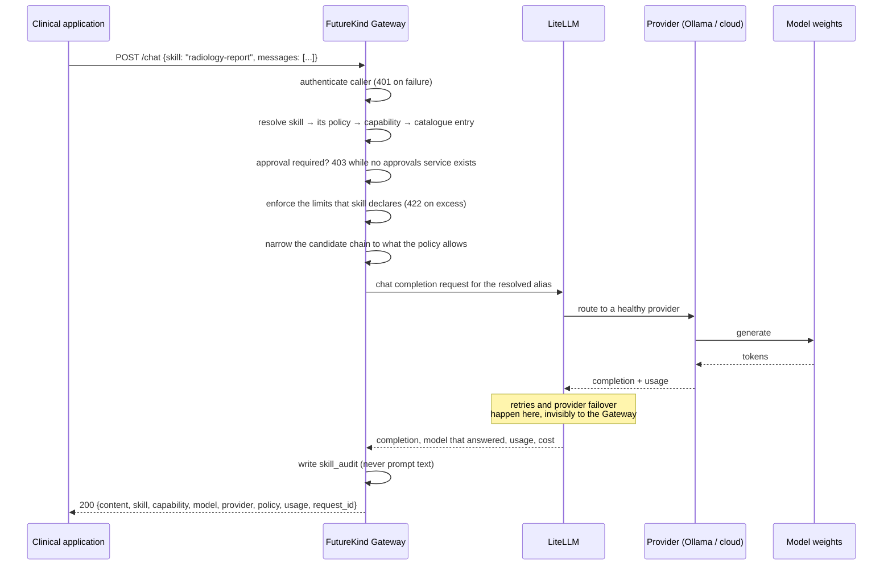
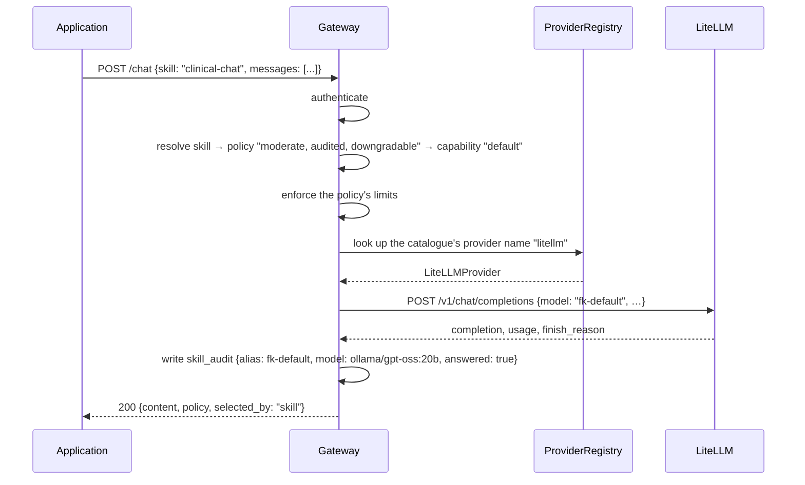
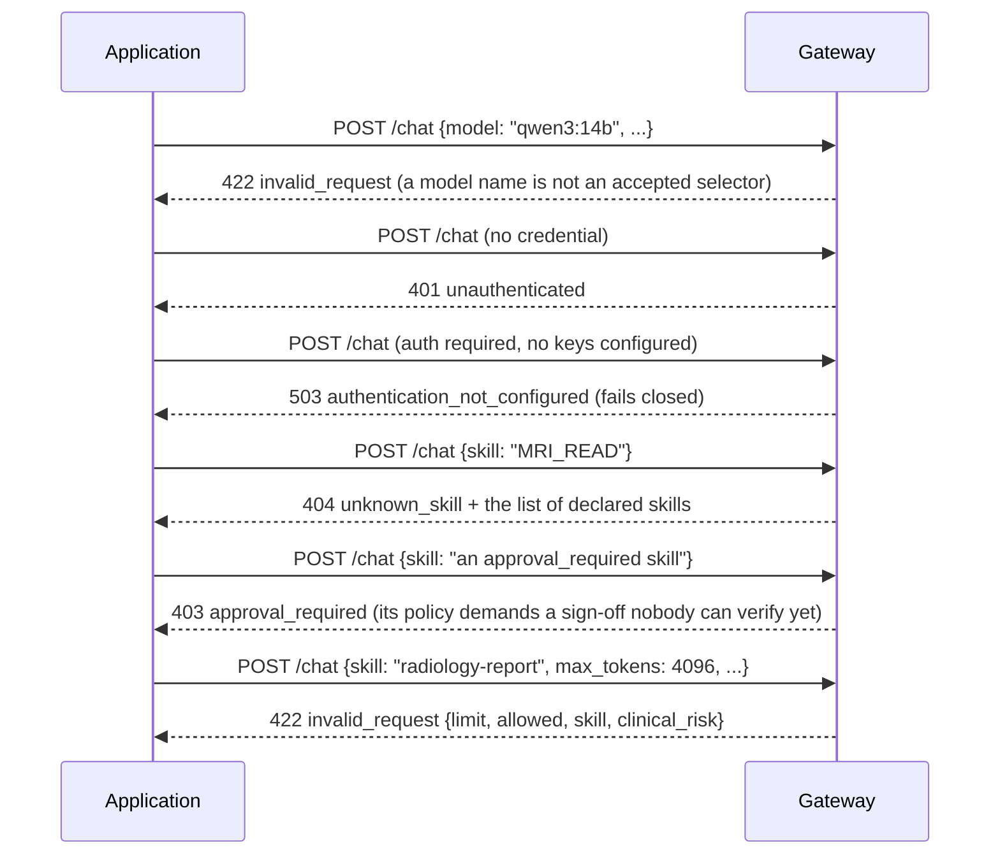

# Gateway Routing Architecture

**Status:** Current design, as of the Sprint 2 policy layer
**Date:** 2026-10-07
**Governing decisions:** [ADR-0001 Local-First AI](../adr/ADR-0001-Local-First-AI.md), [ADR-0002 Gateway vs LiteLLM](../adr/ADR-0002-Gateway-vs-LiteLLM.md)
**Component:** `core/gateway/`
**Read with:** [gateway-policy.md](gateway-policy.md), which documents the policy vocabulary and its validation rules

This document says who decides what on the path from a clinician's click to a
model's answer, and what each layer is forbidden from doing. Where the code and
the decision differ, that difference is named rather than smoothed over.

---

## The chain

```
Application  →  Gateway  →  LiteLLM  →  Provider  →  Model
   intent       policy      routing     transport   weights
```

| Layer | Answers | Owned by | Lives in |
| --- | --- | --- | --- |
| Application | "What am I doing?" | The calling app (CARE ERP, Radiology, …) | its own repo |
| Gateway | "Is this allowed, what does it mean clinically, who asked, and what is the record?" | FutureKind Core | `core/gateway/` |
| LiteLLM | "Which model, on which provider, with what retry?" | FutureKind Services | `services/ai/litellm/` |
| Provider | "How do I talk to this backend?" | FutureKind Services | Ollama / cloud endpoints |
| Model | "Generate." | Nobody — it is hardware | GPU node |

---

## Ownership

### Application

May state: a skill, the conversation, and sampling preferences
(temperature, max tokens, stop sequences).

May not state: a model, a provider, an endpoint, a credential, or which
backend should be tried if the first is busy. A request that includes a model
name is rejected rather than ignored, so the mistake surfaces in development
instead of becoming invisible in production.

### Gateway — owns intent, policy, authorization, audit, clinical context

| Responsibility | Mechanism in `core/gateway/` |
| --- | --- |
| Skill resolution | `catalog.Skill`, `ModelRouter.resolve(skill=…)` |
| Policy | `policy.SkillPolicy` loaded from `models.yaml`, validated at startup, carried on every `Route` |
| Policy enforcement | `policy.check_request` (approval, limits), `routing.build_chain` (downgrade), `service.complete` (timeout) |
| Capability mapping | `catalog.ModelEntry`, the `models:` stanza |
| Authorization | `api/deps.require_api_key` — fail-closed, constant-time compare, non-secret caller label |
| Audit | `observability.logging` structured events; one `skill_audit` line per audited skill, carrying risk, alias, and the model that answered |
| Clinical context | the skill, its declared risk level, and per-application attribution |
| Health | `/health`, `/health/ready` |
| Metrics | `/metrics`, `fk_gateway_*` |

Forbidden: choosing weights, holding provider credentials, retrying a failed
backend, tracking spend, becoming a second model router.

### LiteLLM — owns model aliases, provider routing, model routing, retries, failover, cost

The single place where "which model" is answered. The Gateway hands it an entry
to ask for; LiteLLM decides what that means on this hardware today, and may
decide differently on the next restart without any application or Gateway change.

Forbidden: knowing anything about skills, clinical context, or which hospital
department a caller belongs to. Those are the Gateway's vocabulary and must not
leak down.

### Provider and Model

Transport and compute. Neither sees a capability name. Both are addressable only
through LiteLLM.

---

## Sequence — the request as decided



The same diagram in plain text, for readers without a Markdown renderer:

```
Application            Gateway                     LiteLLM          Provider        Model
    |                      |                          |                 |              |
    |-- POST /chat ------->|                          |                 |              |
    |   skill=radiology-   |                          |                 |              |
    |   report             |-- authenticate ----------|                 |              |
    |                      |-- resolve skill -> policy -> capability -> entry          |
    |                      |-- approval gate (403)    |                 |              |
    |                      |-- enforce skill limits (422)               |              |
    |                      |-- narrow chain to policy |                 |              |
    |                      |---- request for alias -->|                 |              |
    |                      |                          |-- choose ------>|              |
    |                      |                          |                 |-- generate ->|
    |                      |                          |                 |<-- tokens ---|
    |                      |                          |<-- completion --|              |
    |                      |                   (retries and failover live here)        |
    |                      |<-- content, model, usage, cost ------------|              |
    |                      |-- write skill_audit      |                 |              |
    |<-- 200 + request_id -|                          |                 |              |
```

---

## Sequence — the same request as built today

No provider is implemented, so the chain stops at the Gateway's own boundary and
says exactly where it stopped. This is intended behaviour, not a defect:



What is still "as decided" rather than "as built", and who owns each gap:

1. **Closed in Sprint 6.** `models.yaml` no longer names a backend family as its
   provider: every row says `provider: litellm`, and `model:` records what the
   alias resolves to behind LiteLLM (`ollama/gpt-oss:20b`) instead of what the
   Gateway sends. The Gateway sends the **alias**, and the startup comparison with
   `configs/litellm/config.yaml` refuses any alias LiteLLM does not recognise.
   Step 3 of ADR-0002 can now delete `model:` without losing a check.
2. The Gateway still carries its own fallback chain, which overlaps LiteLLM's
   retries. `allow_downgrade` now decides *whether* that chain may be walked at
   all, which is the skill-level half of the answer, but the Gateway still
   orders the concrete candidates — the other half, and still debt.
3. A skill that declares `approval_required: true` is refused rather than run,
   because there is no approvals service that could verify the sign-off.
4. `GET /v1/chat/completions` refuses `stream: true`. OpenAI-format clients ask
   for it by default, so an interface has to be configured for non-streaming
   until SPEC-15-03 fixes what cancellation, timeout and the audit record mean
   for a partial answer.

---

## Sequence — rejection paths



Every one of these answers before a model is reached. That ordering is the
security property: an unauthenticated or malformed request must never consume
GPU time or touch patient data. The last two are answered by the skill's own
policy, which is why they arrive after routing and not before it.

---

## Naming rules

Five identifiers, five namespaces, no overlap:

| Identifier | Example | May appear in a request | May appear in a response | Owner |
| --- | --- | --- | --- | --- |
| Skill | `radiology-report` | **yes** | yes | Gateway |
| Policy | `clinical_risk: high` | no | yes, reported back | Gateway |
| Capability | `reasoning` | yes (legacy) | yes | Gateway |
| Alias | `fk-reasoning` | no | no — log only | Gateway declares it, LiteLLM resolves it |
| Model | `qwen3:14b` | **no** | yes, for provenance | LiteLLM |

A model id is reported but never accepted. The distinction is deliberate: a
clinician must be able to see which model produced a sentence for
medico-legal reasons, while having no way to demand that one in advance. The
same reasoning applies to audit — the record states what ran, the request cannot
choose it.

A policy is written by an operator and read by an application, but never
offered by a caller: accepting `allow_downgrade: false` in a request body would
let the caller decide how carefully it is treated.

`GET /models` exposes skills and the internal routing table as separate fields
for the same reason, and guard tests assert that no skill card ever carries a
`model`, `provider`, `fallbacks`, `api_base` or `alias` field.

---

## What must never happen

1. An application must not call a model backend directly.
2. A request body must not name a model, provider, endpoint or credential.
3. The Gateway must not implement provider retries, per-provider credentials or
   cost accounting — those are LiteLLM's, and a second implementation drifts.
4. LiteLLM must not learn skill names or clinical context.
5. Prompt and completion text must not appear in Gateway logs.
6. A routing failure must not be silently downgraded: if the requested class
   cannot answer, the caller is told.
7. A request body must not carry policy. `allow_downgrade`, `audit_required` and
   the risk levels are the operator's, because a caller that can relax the rules
   applied to it has no rules.

Rule 6 is the one a clinical platform is most likely to break by accident,
because "quietly use a smaller model" looks like reliability while it is
actually a change to the answer's provenance. Rule 7 is how it gets broken on
purpose: the convenient request field is the one that says "this patient can
wait for the good model".

---

## Remaining architectural debt

- The Gateway's fallback chain duplicates LiteLLM's retry behaviour. `allow_downgrade`
  now decides whether it may be walked at all, which is the skill-level half; the
  Gateway still orders the concrete candidates, which is the half step 4 should
  delete.
- `capability` is still accepted on the public request, so two selectors exist
  where one is intended — and a request that uses only it carries no declared
  clinical risk, and is reported as `unspecified`.
- Approval is enforced as a refusal. A skill may declare `approval_required: true`
  today and the Gateway will honour it by declining to run; making it runnable
  needs an approvals boundary, and a self-attested request field would be a
  falsified signature rather than a workflow.
- Model ids are still stored in the Gateway catalogue; step 3 of ADR-0002
  replaces them with aliases alone. They are no longer *sent* anywhere, and the
  startup check compares them with LiteLLM's own file, so what remains is a
  deletion rather than a redesign.
- The provider-transport name and the backend family share one field name in
  configuration history. `docs/DOMAIN_MODEL.md` should give "provider" one owner
  before another service writes `provider: ollama` and reads it as a backend.
- The OpenAI-compatible door ignores the sampling fields it does not model
  (`n`, `seed`, `presence_penalty`, and the rest) rather than refusing them. A
  client asking for two candidates silently gets one; either honour `n` or
  refuse it.
- `GET /v1/models` requires a credential while `GET /models` does not. Two doors
  with different rules about who may look is a defect in the older one, already
  recorded as rows 1–3 of `docs/CONSTITUTION.md §7` and owned by ADR-0004.
- `core/gateway/openapi.yaml` was a hand-written four-path stub. The served
  `/openapi.json` is the tested contract, and the stub is deleted (2026-10-08), so
  there is one contract now — the one a client actually generates from.
- Skills are not yet a metric label, so per-skill load and per-risk load are not
  visible in `/metrics` even though both are now on every log line.
- `default` / `fast` / `reasoning` conflate service class with task type; the
  capability set and a tier axis are unresolved, and ADR-0002 `:154` refuses to
  invent the tier axis before there are `vision` or `embedding` aliases to
  populate it.
- Policy has no version of its own: `models.yaml` is edited in place, so "what
  was the risk classification when this answer was given?" is only answerable
  from the audit log, not from the file.

Each of these is a decision about *where* a choice is made, which is what this
document is for. The provider code that exists today was written after them, not
around them: it holds no model list, retries nothing, and invents no endpoint.
